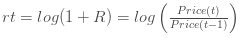

# Bitstamp Bitcoin/USD Analysis

Descriptive statistics and probability distributions  

## Prerequisite

* [Install RStudio](https://www.rstudio.com/products/rstudio/download/)
* [Install R](https://cran.r-project.org/)


## Using jsonlite et Curl to retrieve data

```
> install.packages("jsonlite")
> library(jsonlite)
> install.packages("curl")
```

## Analysis

Retrieve a currency pairs, we use data provided by quandl

* BTC/USD

```
> btcsusd <- fromJSON(txt='https://www.quandl.com/api/v1/datasets/BCHARTS/BITSTAMPUSD.json?&trim_start=2013-09-01&trim_end=2014-12-10&sort_order=asc')
```


```
> dates <- as.Date(btcsusd$data[,1],format="%Y-%m-%d")
> rates <- as.numeric(btcsusd$data[,5])
```

Let's plot some data

```
> plot(dates,rates)
```


Let's use some Continuous Compounded Return data by adding parameter retclass="ts" (Zoo class might be better)

```
> btc.ts <- as.ts(rates)
```

Probability Density Function

To Create the  function of returns, I use the diff function to calculate  from 

```
> btc.pdf <- log(lag(btc.ts))-log(btc.ts)
```

or 

```
> btc.pdf <- diff(log(btc.ts))
```


Some Descriptive Statistics:

The mean 

```
> mean(btc.pdf)
[1] 0.006749139
```

The Variance 

```
> var(btc.pdf)
[1] 0.001528914
```

As you can see a +.15% average return is not that interesting but again I believe Bitcoin Virtual Currency is still the way to go.

The Standard Deviation 

```
> sd(btc.pdf)
[1] 0.05436408
```

Same for the standard deviation, 5% may look risky for an investor.

## Using Performance Analytics

```
> install.packages("PerformanceAnalytics")
> library(PerformanceAnalytics)
```

Analysing data  

```
> skewness(btc.pdf)
[1] 0.00998609

> kurtosis(btc.pdf)
[1] 7.774766
```

Finally some Bell Curve Equation 

Showing that Bitcoin still has fat tails a good candidate for Black Swan Theory.

```
> chart.Histogram(btc.pdf)
```


